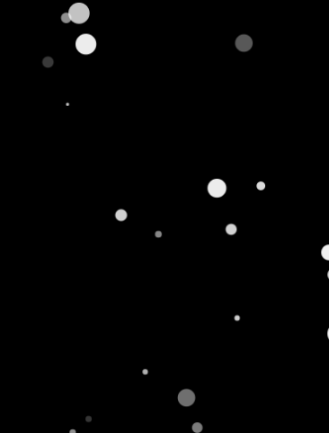
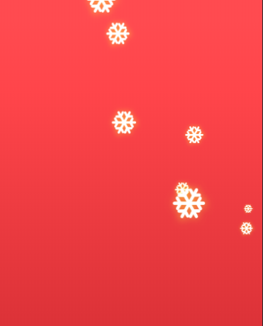

# snow

## canvas下雪效果

### 参数列表
```typescript
export type SnowflakeRandomOptions = {
    speedX?: {
        max?: number;
        min?: number;
    };
    speedY?: {
        max?: number;
        min?: number;
    };
    opacity?: {
        max?: number;
        min?: number;
    };
    size?: {
        max?: number;
        min?: number;
    };
};

export type SnowOptions = SnowflakeRandomOptions & {
    container: HTMLElement;
    density: 'middle' | 'big' | 'light' | number;
    draw?(canvas: HTMLCanvasElement, context: CanvasRenderingContext2D, snowflake: Snowflake): void;
};
```
参数说明

|参数名称|参数类型|参数说明|
|-|-|-|
|container|HTMLElement|canvas容器|
|density|number|string|雪花的密度|
|draw|function|自定义雪花绘制|
|speedX|object|雪花的水平方向速度范围|
|speedY|object|雪花的垂直方向的速度范围|
|opacity|object|雪花的透明度|
|size|object|雪花的大小范围|

### 示例一
```javascript
var snow = new Snow({
    container: document.getElementById('container'),
    density: 1
});
snow.startAnimation();
```


### 示例二

你可以通过`draw`方法实现自定义渲染.

```javascript
var image = new Image();
image.onload = function() {
    var snow = new Snow({
        container: document.getElementById('container'),
        density: 'middle',
        draw: function(canvas, context, snowflake) {
            var locationX = snowflake.locationX,
                locationY = snowflake.locationY,
                size = snowflake.size;    

            context.beginPath();
            context.fillStyle = "transparent";
            context.arc(locationX, locationY, size, 0, Math.PI * 2);
            context.drawImage(image, locationX - 1.45 * size, locationY - 1.45 * size, size * 3 , size * 3);
            context.closePath();
        }
    });
    snow.startAnimation();
};

image.onerror = function() {
    console.error('onerror');
};

image.src = './snowflake.png';
```

如指定雪花图片.最终生成的效果图如下:



### 方法列表
|方法名称|方法说明|
|-|-|
|startAnimation()|开始动画|
|stopAnimation()|停止动画|
|destroy()|销毁|
